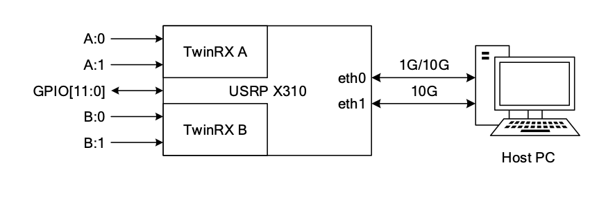
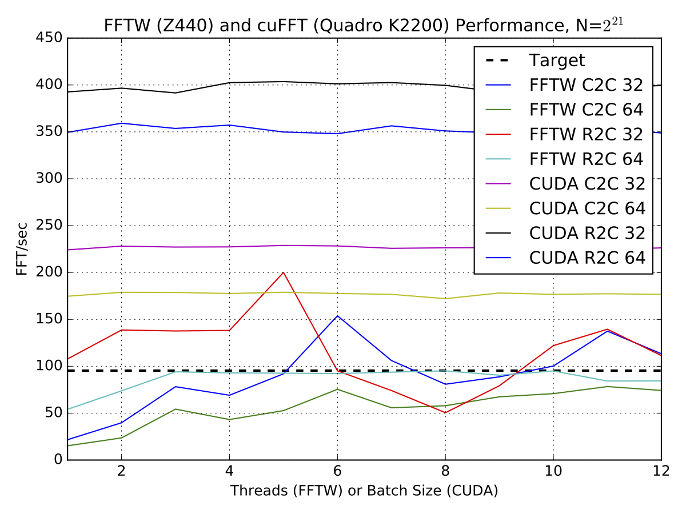
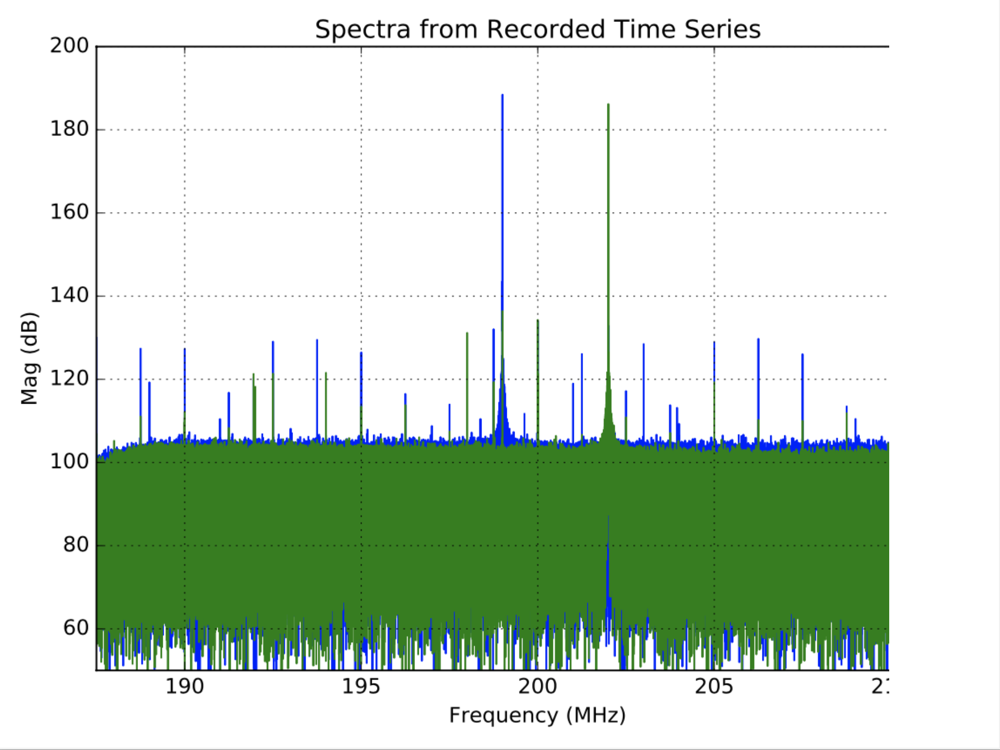
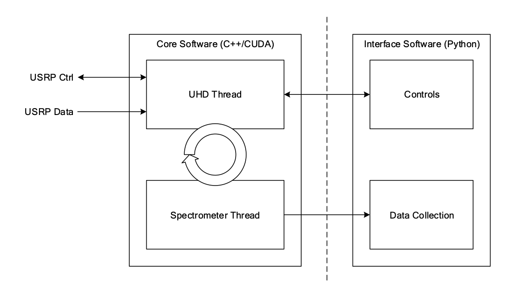

# About this repository

Stephen Harrison authored this work and has kindly let me post it publically. The rest of this README is a markdown-ified version of his report on the topic.

## The USRP X310 as a Prototype EMI Test Platform

Author: S. Harrison, Dominion Radio Astrophysical Observatory

### Abstract

The USRP X310 is suggested in the SKA DSH EMI control plan as a lower-cost alternative to the Tektronix RSA5106A real-time spectrum analyzer. The recommendation is to capture data samples from the USRP to disk and post-process the results. In this work we explore the possibility of using the USRP as an online EMI receiver. The USRP receive rate is benchmarked using both 1G and 10G Ethernet connections. The FFT size to achieve the required frequency resolution is benchmarked using a CPU implementation (FFTW) and a GPU implementation (cuFFT). Prototype software is developed.

### Introduction

The USRP X310 is considered in [^blatch] as a low-cost alternative to the Tektronix RSA5106A real-time spectrum analyzer. There have been some attempts to use the USRP diagnose interference in wireless systems [^qureshi], study EMI signatures of appliances [^gulati], and to measure and log EM spectra [^petersson]. We also note that the USRP X310 supports an FPGA-accelerated RTSA application called fosphor, which is limited to 1024 channels[^munaut]. The fosphor application also has an OpenCL implementation, which can utilize any supported GPU. We explore the suitability of using the X310 in a similar manner to meet the requirements in [^blatch].

### System Description

The available host PC is an HP Z440 Workstation with Intel Xeon E5-1650 v3 CPU running at 3.5 GHz. This CPU has six cores (12 threads) and 32 GB of RAM. The host PC also has an NVIDIA Quadro K2200 graphics card, which has 640 cores and is supported by CUDA. The SDR device is an Ettus Research USRP X310 fit with two TwinRX boards configured for LO sharing as per [^ettus]. A simplified block diagram of the setup is shown in the following figure.



The 10GE card is Intel X710-DA2. An SFP+ direct attach copper cable is used to connect the USRP to the host PC.

### System Requirements

The basic system requirement is to provide $\approx$100 Hz frequency resolution over the full bandwidth.  

### System Performance

#### FFT Benchmarks}

The performance of the well-known FFTW library was compared to the performance of the CUDA clFFT library for transforms of size $N=2^{21}$. Both single- and double-precision transforms were investigated, as well as Complex/Complex and Real/Complex transforms. For FFTW the multithreaded version was used, and the number of threads was varied from 1 to 12. For CUDA the batch size was varied from 1 to 12. All results were averaged over 1000 executions of the transform. Results are shown in the following figure.



From these results it appears clear that for this application CUDA will outperform FFTW. We also observe that changing the batch size in this range makes almost no difference for this size of transform. We also observe that the FFTW results vary significantly with the number of threads.

#### USRP Benchmarks

Canned benchmark tests were run using the example programs distributed with the UHD library. Using the provided SFP adapter for Gigabit Ethernet, the `benchmark_rate` program was run in receive-only mode. This confirms that the X310 can continously stream up to 25 MSPS using GigE as advertised in the literature.

```bash
$ ./benchmark_rate --duration 300 --rx_rate 25e6

...

[00:00:04.353326] Setting device timestamp to 0...
[00:00:04.360702] Testing receive rate 25.000000 Msps on 1 channels
[00:05:04.461071] Benchmark complete.


Benchmark rate summary:
  Num received samples:     7500025214
  Num dropped samples:      0
  Num overruns detected:    0
  Num transmitted samples:  0
  Num sequence errors (Tx): 0
  Num sequence errors (Rx): 0
  Num underruns detected:   0
  Num late commands:        0
  Num timeouts (Tx):        0
  Num timeouts (Rx):        0
```

The Linux utility `top` showed CPU utilization around 53% during this time. The stock version of `benchmark_rate` promotes the over the wire format to float, but does not provide arbitrary buffer sizes. A modified version was run with the same parameters but accepting $2^{21}$ samples per buffer. The CPU utilization was observed to be slightly lower, around 48%.

The UHD example program `rx_samples_to_file` was run to capture data from each input to confirm the TwinRX boards work as expected. The figure below shows some spectra generated from the captured time series. A signal generator was set up with both 199 MHz and 202 MHz outputs. The USRP center frequency was set to 200 MHz. We observe these signals in the expected places and this confirms that the data is interpreted correctly.



10GE Benchmarks TBD.

### Prototype Software

The prototype software design consists of a core portion and an interface portion, which are connected by some message passing interface such as ZeroMQ. This allows the control and display portions to be run on a computer with fairly generic requirements (e.g.: Windows laptop), while the computer running the core software can be optimized for performance. A simplified block diagram is shown in the following figure.



Lacking any evidence to the contrary, we simply assume the performance of UHD is adequate and rely on it to perform the following tasks:

1. Receive packet stream and unpack samples.
2. Promote over the wire format (16+16 complex) to single-precision floating point.
3. Form chunks of $N$ samples, regardless of underlying packet sizes.

A ring buffer is used to transfer pointers to the data from the UHD thread to the spectrometer thread. Everything to do with the ring buffer is allocated statically. Initially this was attempted in a single thread but it could not keep up with the data rate.

The spectrometer thread waits on the ring buffer, and then copies the data to the GPU using `cudaMemcpy()`. The clFFT library is used to perform a single-precision in-place FFT. The square magnitude is computed and then added to a running accumulator. After a configurable interval the accumulator result is copied back to the host.

### Conclusion

### Bibliography

[^blatch]: R. Blatch, "Dsh emi control plan,"  Square Kilometre Array, 201-0000000-011, 2016.
[^qureshi]: A. Qureshi, “Interference diagnosis in wireless systems by using ni usrp,” International Journal of Simulation: Systems, Science and Technology, vol. 16, no. 6, pp. 10–1, 2015.
[^gulati]: M. Gulati, S. S. Ram, and A. Singh, “An in depth study into using emi signatures for appliance identification,” arXiv:1409.4438 [cs], 2014. [Online]. Available: [http://arxiv.org/abs/1409.4438](http://arxiv.org/abs/1409.4438)
[^petersson]: J. Petersson, “System for measuring and logging electromagnetic frequency spectra with soft-ware defined radio,” Bachelor Thesis, Chalmers University of Technology, 2016.
[^munaut]: S. Munaut, “Rfnoc: fosphor - how to apply rfnoc to rtsa display acceleration,” 2015.
[^ettus] E. Research, “Twinrx hardware installation guide,” 2016. [Online]. Available: [https://kb.ettus.com/images/c/cc/twinrx_hardware_installation_guide.pdf](https://kb.ettus.com/images/c/cc/twinrx_hardware_installation_guide.pdf)
